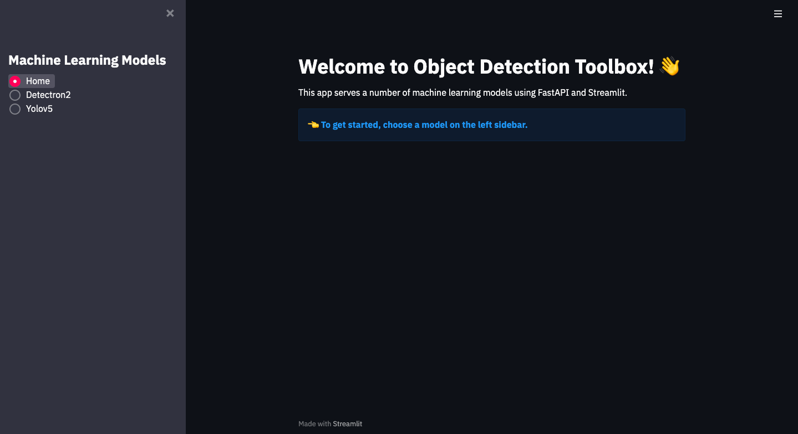
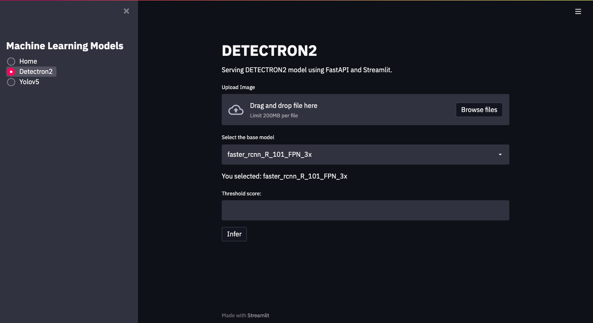
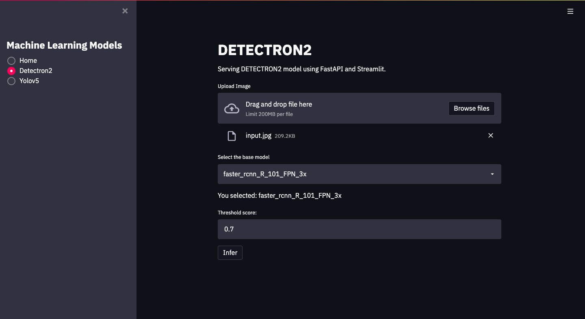
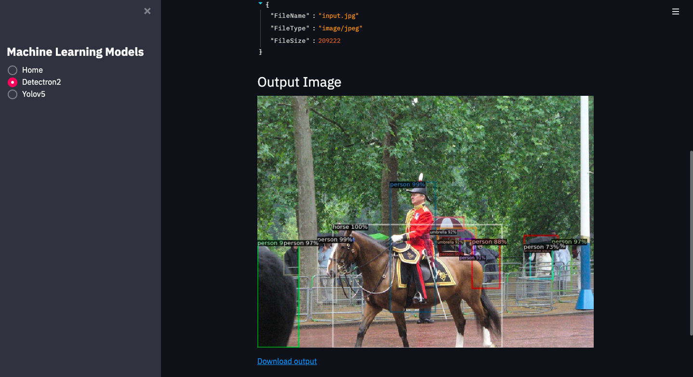
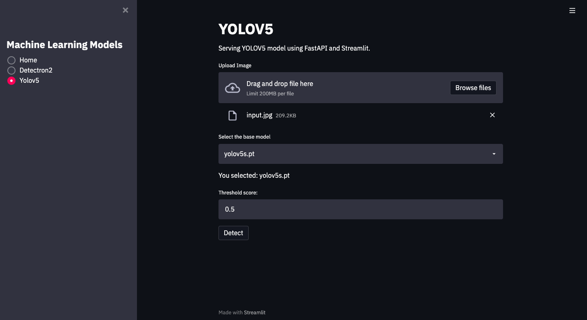
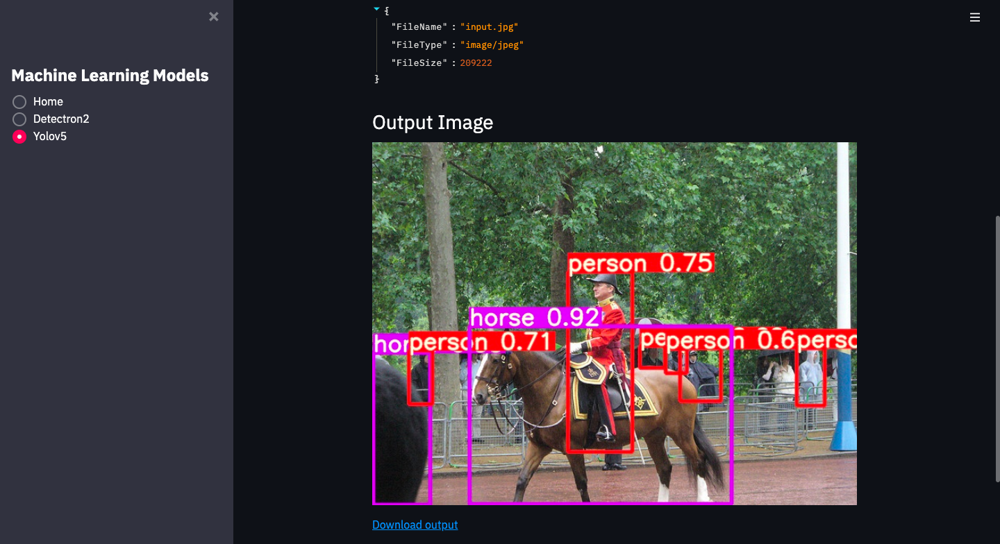

# ObjectDetectionToolbox

1. Clone Detectron2 repo  
`git clone https://github.com/facebookresearch/detectron2.git`

2. Git clone Yolov5  
`git clone https://github.com/ultralytics/yolov5.git`

3. Create virtual environment and activate  
`pip install virtualenv` 
`virtualenv venv` 
`source venv/bin/activate`

4. Install required packages  
`pip install -r requirements.txt`

5. To run FastAPI server execute the following command in the terminal 
`uvicorn main:app --reload --workers 1 --host 0.0.0.0 --port 8008`

6. Start the Streamlit server 
`streamlit run app.py`

Open this link http://localhost:8501 in your favorite browser to acess Streamlit frontend.

1. As you can see, the below image is the landing page.
 

2. You can select the model from the left sidebar. Let's select Detectron2. 

3. Input an image, choose a base_model and set the threshold score and click infer. 

4. You can see the objects detected by Detectron2 in the output. You can also download the output image. 

5. Similarly, you can choose Yolov5 from the sidebar and input the values. Click detect. 

6. You can see the objects detected by Detectron2 in the output. You can also download the output image.

